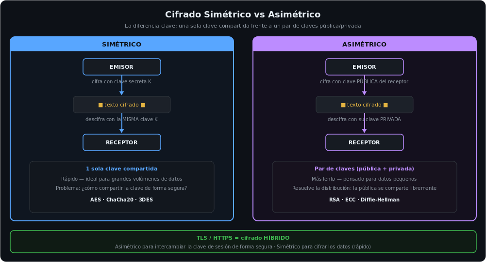

<h1 align="center">Criptografía Aplicada</h1>

<p align="center">
  
  
  
  
  
</p>

---

## Sobre este módulo

15 ejercicios de criptografía aplicada resueltos con Python (PyCryptodome) y GPG: desde disociación de claves y cifrado simétrico/asimétrico hasta detección de un intento real de escalada de privilegios vía JWT y explotación de una vulnerabilidad de reutilización de nonce en AES-GCM. El foco no es la teoría — es identificar **qué falla quedaría explotado en producción** y cómo corregirlo.

---

## Cifrado simétrico vs asimétrico



---

## Casos destacados

### JWT — escalada de privilegios detectada y bloqueada

Un **JWT** (*JSON Web Token*: un token firmado que transporta la identidad y los permisos de un usuario entre cliente y servidor) firmado con HMAC-SHA256 (`rol: isNormal`) fue interceptado y modificado por un atacante a `rol: isAdmin`. Al no conocer la clave secreta, no pudo regenerar una firma válida — PyJWT rechazó el token en la verificación.

```
Token original → rol: isNormal → firma válida
Token alterado → rol: isAdmin  → firma inválida → rechazado
```

**Lección:** la integridad de un JWT depende 100% del secreto de firma; nunca debe decodificarse sin verificar.

### AES-GCM — vulnerabilidad de nonce reutilizado

Un sistema reutilizaba siempre la misma clave y el mismo **nonce** (*number used once*: un valor que debe ser único e irrepetible en cada cifrado) en AES-GCM — esto rompe por completo las garantías del esquema **AEAD** (*cifrado autenticado*: cifra los datos y a la vez detecta cualquier manipulación), permitiendo recuperar el keystream y falsificar los tags de integridad. Corrección aplicada: nonce aleatorio de 12 bytes por mensaje con `Crypto.Random.get_random_bytes`.

### ChaCha20 → ChaCha20-Poly1305 (AEAD)

ChaCha20 solo garantiza confidencialidad, pero no integridad. Se migró a **ChaCha20-Poly1305**: Poly1305 añade un tag MAC sobre el ciphertext, de forma que cualquier bit modificado invalida el descifrado — equivalente a AES-GCM en el mundo de cifrado por bloques.

### Almacenamiento seguro de contraseñas

Cadena de mejora evaluada: **SHA-1** (roto — ataques de colisión teóricos desde 2005, colisión práctica pública en 2017 con *SHAttered*) → **SHA-256 + Salt** (un *salt* es un valor aleatorio que se añade a cada contraseña antes de hashear, para que dos claves iguales no produzcan el mismo hash; evita las *rainbow tables* —tablas precomputadas de hashes—, pero SHA-256 sigue siendo rápido = vulnerable a fuerza bruta con hardware dedicado) → **Argon2id** (computacionalmente costoso por diseño, resistente incluso con GPU/ASIC).

---

## Ejercicios resueltos (resumen técnico)

| # | Ejercicio | Resultado clave |
|---|---|---|
| 1 | Disociación de clave XOR | Clave dinámica recuperada vía `A XOR C = B` sobre clave de 16 bytes |
| 2 | AES/CBC/PKCS7 | Descifrado correcto; padding PKCS7 vs X9.23 visualizado en CyberChef |
| 3 | ChaCha20 → AEAD | Cifrado + propuesta de integridad con Poly1305 |
| 4 | JWT (HS256) | Ataque de escalada de rol detectado y rechazado |
| 5 | SHA3-256 / SHA2-512 | Efecto avalancha verificado (1 carácter cambia el hash completo) |
| 6 | HMAC-SHA256 | HMAC calculado; nota sobre encoding de caracteres especiales |
| 7 | Hashing de contraseñas | SHA-1 → SHA-256+Salt → Argon2id |
| 8 | API REST sin TLS | Diseño AEAD (AES-GCM/ChaCha20-Poly1305) para campos sensibles |
| 9 | KCV (Key Check Value) | Verificación de clave AES sin revelarla (KCV-SHA256 y KCV-AES) |
| 10 | PGP/GPG | Verificación de firma, firma de respuesta, cifrado multi-destinatario |
| 11 | RSA-OAEP | Descifrado de clave de sesión; aleatoriedad del re-cifrado explicada |
| 12 | AES-GCM nonce reuse | Vulnerabilidad identificada y corregida |
| 13 | Firma digital RSA vs Ed25519 | Firma sobre el hash del mensaje, no sobre el mensaje directo |
| 14 | HKDF-SHA512 | Derivación de clave AES-256 a partir de clave maestra + salt por dispositivo |
| 15 | TR-31 Key Block | Desempaquetado de bloque de claves de pago (KBPK) |

---

## Código propio en este repositorio

Cada script implementa el ejercicio correspondiente de la tabla de arriba (el número indica a cuál):

`01-xor-disociacion-clave.py` · `02-aes-cbc-pkcs7.py` · `03-chacha20-poly1305.py` · `04-jwt-hs256.py` · `05-sha3-avalancha.py` · `06-hmac-sha256.py` · `07-argon2-passwords.py` · `09-kcv.py` · `11-rsa-oaep.py` · `12-aes-gcm-nonce.py` · `13-firma-rsa-pkcs1v5.py` · `13-firma-ed25519.py` · `14-hkdf-sha512.py` · `15-tr31-keyblock.py`

> Los ejercicios **08** (rediseño de una API sin TLS — ejercicio de diseño) y **10** (firma y cifrado con GPG por línea de comandos) no llevan script propio: se resolvieron sin código Python.

---

## Stack

`PyCryptodome` · `GPG / PGP` · `PyJWT` · `CyberChef` · `psec (TR-31)` · `hashlib` · `Argon2`

---

## Objetivos cumplidos

- [x] Cifrado simétrico (AES-CBC, AES-GCM, ChaCha20-Poly1305) implementado y verificado
- [x] Cifrado asimétrico (RSA-OAEP) y firma digital (RSA PKCS#1 v1.5, Ed25519, PGP)
- [x] Vulnerabilidad real de reutilización de nonce identificada y corregida
- [x] Ataque de escalada de privilegios vía JWT detectado y bloqueado
- [x] Derivación de claves (HKDF) y verificación sin exposición (KCV)
- [x] Diseño de esquema AEAD para proteger una API sin depender de TLS

---

## Módulos relacionados

- **[Blue Team](https://github.com/juanmalbran/Blue-Team)** — TLS/SSH y PKI como pilares de la defensa de red.
- **[Pentesting](https://github.com/juanmalbran/Pentesting)** — ataques criptográficos: hash cracking, JWT weak signing, downgrade attacks.
- **[DevSecOps](https://github.com/juanmalbran/DevSecOps)** — cosign/Sigstore para firma de imágenes y Sealed Secrets en Kubernetes.

---

<div align="center">
  <sub>Parte del portfolio de <a href="https://github.com/juanmalbran">Juan Malbrán · M4LBYTE</a></sub>
</div>
